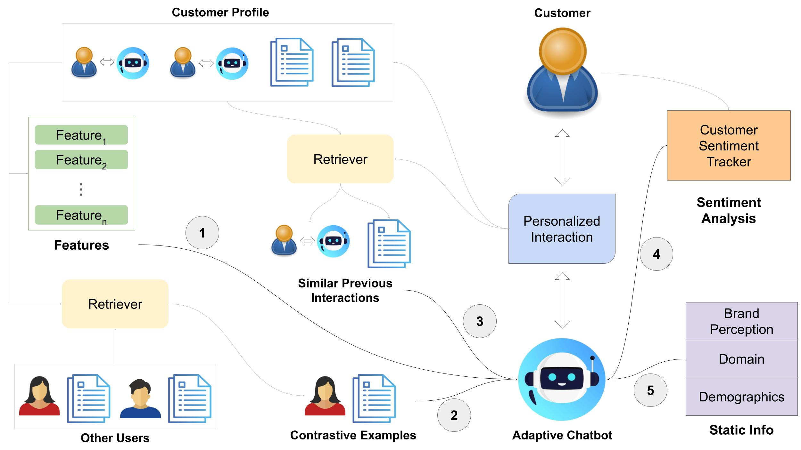
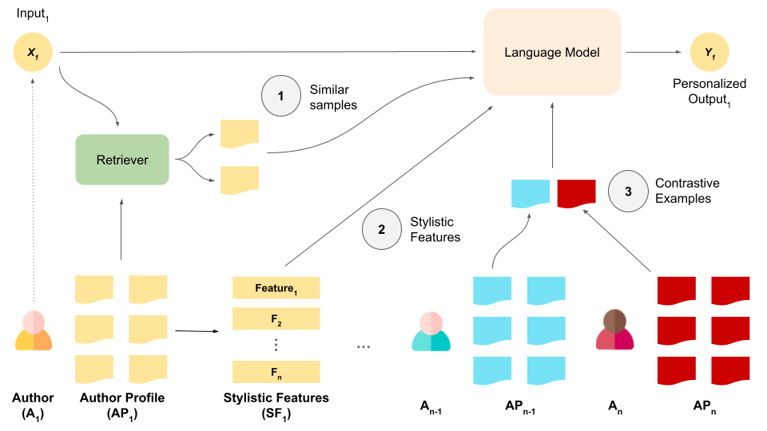

# AP-Bots: Adaptive, Personalized Chatbots

AP-Bots is a framework aimed to increase the user satisfaction with chatbots by offering personalized, adaptive responses. The framework processes customer sentiments, personality, and the context of the conversation to choose the best conversation style for the customer. The bot tailors its responses for the customer, and it can change its style if the customer emotional state gets negative. This repo contains all the works related to AP-Bots. 

**Framework**

<p align="center">
  
</p>
  
## Content

- [Improving RAG for Personalization with Author Features and Contrastive Examples](#improving-rag-for-personalization-with-author-features-and-contrastive-examples)
  - [Running Experiments](#running-experiments)
  - [Evaluation](#evaluation)
- [Requirements](#requirements)


## Improving RAG for Personalization with Author Features and Contrastive Examples

This section provides information for the corresponding paper. 

**Abstract**

_Personalization with retrieval-augmented generation (RAG) often fails to capture the fine-grained features of authors, making it hard to identify their unique traits. To enrich the RAG context, we propose providing Large Language Models with author-specific features, such as the average sentiment polarity and frequently used words, in addition to past samples from the author’s profile. We introduce a new feature called Contrastive Examples, which retrieves documents from other authors to highlight what distinguishes a particular author. Our experiments show that adding a couple of sentences about which named entities, dependency patterns, and words a person uses frequently significantly improves personalized text generation. Combining features with contrastive examples boosts the performance further, achieving a relative 15% improvement over baseline RAG while outperforming the benchmarks. Our results show the value of fine-grained features for better personalization, while opening a new research dimension to include contrastive examples as a complement with RAG._

<p align="center">
  
</p>
  
### Running Experiments

Run an experiment with the following command:

```bash
python run_exp.py -d lamp_5_dev_user -k 5 -f WF DPF -r contriever -ce 3
```

| Argument                         | Data Type    | Description                                                                                                                | Default             |
|----------------------------------|--------------|-------------------------------------------------------------------------------------------------------------------------|---------------------|
| `-d`           | `str`        | Name of the dataset. Supported formats:                                                                                     | `amazon_Grocery_and_Gourmet_Food_2018`|
|                              |              | - **LaMP**: `lamp_{dataset_num}_{data_split}_{user/time_split}` (e.g., `lamp_4_test_user`, `lamp_5_dev_time`).              |                     |
|                              |              | - **Amazon**: `amazon_{category}_{year}` (e.g., `amazon_All_Beauty_2018`).                                                |                     |
| `-k`             | `int`        | Number of documents to retrieve for RAG. If `None`, inferred from user profiles.                                           | `None`              |
| `-f`              | `str`     | Space-separated list of features to use (WF DPF SP).                                                                        | `None`              |
| `-r`            | `str`     | Retriever model to use (`contriever`, `dpr`, or any model from [SentenceTransformers](https://www.sbert.net/)).             | `contriever`        |
| `-ce` | `int`     | Number of contrastive users to include. If `None`, this method is not applied.                                             | `None`              |
| `-rs`| `int`        | Number of times the instruction is repeated in the prompt.                                                                 | `1`                 |
|`-ob`  | `bool` | Bool for creating a batch job with the [OpenAI client](https://platform.openai.com/docs/guides/batch/getting-started?lang=node), works only with GPT-based models. | `False`

### Evaluation

Evaluate a dataset with the following command:

```bash
python -m evaluation.eval -d dataset_name
```

This command evaluates all results in the preds folder for the specified dataset and generates a CSV file in the evaluation directory.

## Requirements

Ensure you have the following installed:

- **Python**: `>= 3.11.3`
- **CUDA**: `>= 12`

Install the required Python packages:

```bash
pip install -r requirements.txt
```
